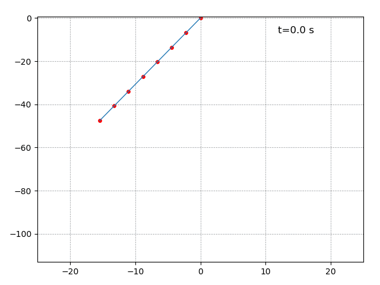

# Tethers.jl
[](https://ufechner7.github.io/Tethers.jl/dev)  

## Introduction

A few examples where tether models can be useful:
- cranes
- undersea cables
- mooring lines of floating wind turbines
- airborne wind energy systems
- launching of sailplanes



Modeling of tethers and cables is difficult for several reasons. One of them is the high stiffness of the equation systems that need to be solved. I tried to implement these models with Simulink and Modelica and failed. It is possible to implement these models with Julia or Python. How to do this is explained in this tutorial. Tethers that are reeled in and out from
a winch are even more challenging to model than constant-length tethers.

A series of examples, from a simple falling mass towards a tether model, consisting of point masses connected by spring damper elements with the support of reel-out and reel-in and aerodynamic drag attached shall be presented.

-- WORK IN PROGRESS --

## Installation

1. make sure you are running a `bash` terminal (shell) and you have at least 16GB RAM (MAC, Linux and Windows supported).  
   On Windows, you can use [git for windows](https://gitforwindows.org/) which provides git AND a bash shell, but for using Julia from a `bash` terminal you must also install either  [Installation and usage of VSCode](https://ufechner7.github.io/Tethers.jl/dev/vscode/) or [Windows Terminal](https://learn.microsoft.com/en-us/windows/terminal/install). `Windows Terminal` is the simple and clean solution, `VSCode` the comfortable, fancy solution.
2. install Julia 1.10 using `juliaup`, see [https://github.com/JuliaLang/juliaup](https://github.com/JuliaLang/juliaup). If `juliaup` is already installed, the following commands will do:
```
juliaup add 1.10
juliaup default 1.10 
```

Check out from git:
```bash
cd repos # any folder of your choice, but without spaces in the folder name
git clone https://github.com/ufechner7/Tethers.jl
```

Build the system image:
```bash
cd repos/Tethers.jl
cd bin
./create_sys_image
```

## Basic example
Use the provided script to start Julia from the `Tethers.jl` folder:
```bash
cd repos/Tethers.jl
./bin/run_julia
```
From the Julia prompt, run the simulation:
```julia
include("src/Tether_01.jl")
```
You should see a plot similar to:


This example shows a mass that is thrown upwards, slows down and then falls.

**HINT**  
You get a menu from which you can run any of the examples by typing
```julia
menu()
```
at the Julia prompt.

**Julia code:** [Tether_01.jl](https://github.com/ufechner7/Tethers.jl/blob/main/src/Tether_01.jl)

## Python version as comparison
From the Julia prompt execute:
```
include("src/RunTether.jl")
```
This will install Python, Matplotlib and Assimulo and execute the script `Tether_01.py`.

**Python code:** [Tether_01.py](https://github.com/ufechner7/Tethers.jl/blob/main/src/Tether_01.py)

If you compare the Python and the Julia scripts you can see that:
- the Julia script is shorter and easier to read
- Julia is about 16 times faster when running the simulation

Have a look at the [Examples](https://ufechner7.github.io/Tethers.jl/dev/examples/) that teach you how to construct a full tether model step by step.

## Overall comparison
Execution time for a simulation of 10s duration with logging the state every 20ms.
Relative and absolute tolerance: $1.0^{-6}$. CPU: Ryzen 9 7950X.

| Test-case             | Lines of code (LOC) Julia | LOC Python | Time Julia [ms] | Time Python [ms] |
|:----------------------------|:-------------------:|:----------:|:---------------:|:---:|
|Falling mass                 |     41              | 56         | 0.17            | 2.6 |
|Non-linear Spring damper     |     59              | 83         | 0.61            | 20  |
|dito with callbacks          |     67              | 103        | 0.74            | 31  |
|swinging tether, 5 segments  |    122              | 150        | 3.50            | 47  |
|Dyneema tether, reeling out  |    136              | 160        | 20              | 9300 |
|dito with callbacks          |    168              |            | 26              |      |
|Dyneema, reeling out with drag |  174              |            | 28              |      |  

**Tradeoff Julia vs Python:** In Julia, the code is compiled before it is executed, which can cause about one to 10 seconds delay when running a simulation the first time, but speeds up the execution a lot afterward. In addition, Julia can run fully multithreaded, Python cannot make use of multiple CPU cores with multithreading because of the global interpreter lock. 

Furthermore, the IDA solver is hardly capable of handling a simulation with the very stiff
Dyneema tether. It achieves only 0.24% of the performance of the Julia solvers.

See also: [Why Julia?](https://ufechner7.github.io/2022/08/13/why-julia.html) and read the [documentation](https://ufechner7.github.io/Tethers.jl/dev/).


